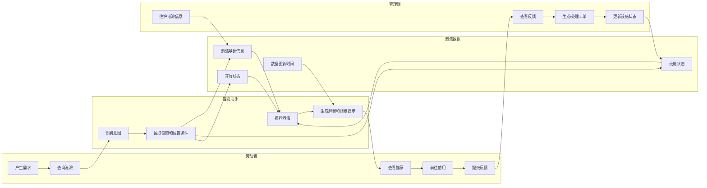
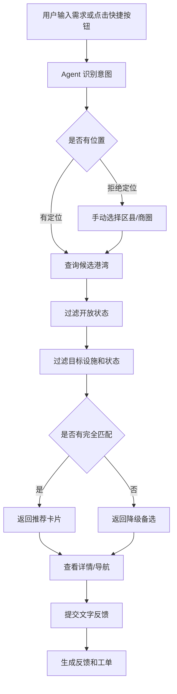
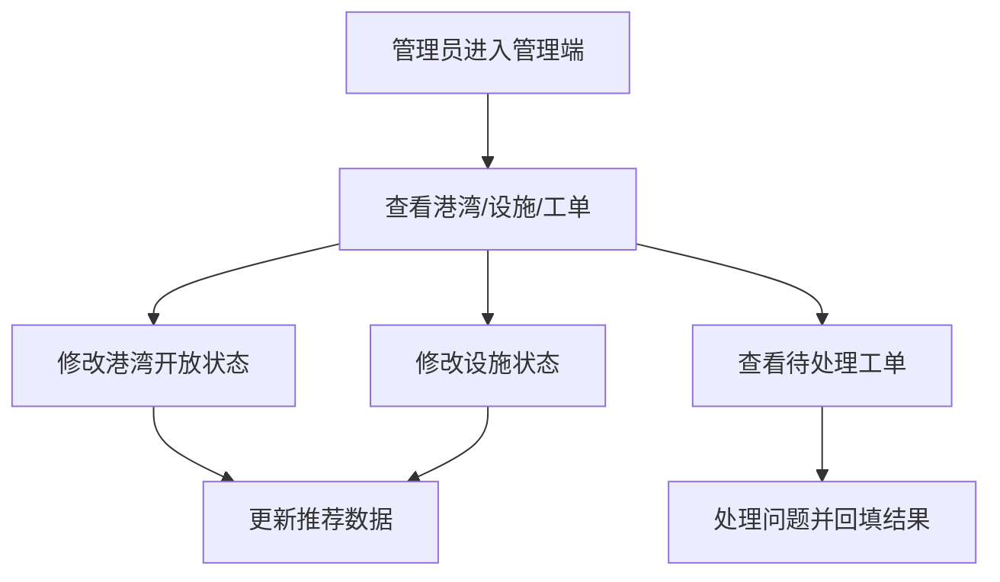

# 劳动者港湾智能助手 AI 产品经理项目 PRD

版本：V0.1  
撰写日期：2026-07-08  
文档定位：AI 产品经理项目 PRD / 作品集叙事版  
关联文档：`劳动者港湾智能助手_PRD_V1.0.md`  

> 本文档与原产品 PRD 分开维护。原 PRD 偏产品需求细节、Agent 能力、数据库与验收；本文档偏 AI 产品经理视角，强调业务调研、业务分析、方案设计、测试验证、指标验收和项目讲述。

---

## 1. 业务调研

### 1.1 客户-业务-行业分析

#### 1. 客户名称（Client Name）

劳动者港湾建设及运营相关主体。

本项目以“重庆市劳动者港湾建设及使用状况”为背景，客户对象可抽象为：

- 城市公共服务主管单位
- 工会或劳动者服务组织
- 港湾运营/管理单位
- 具体港湾点位管理人员
- 面向劳动者服务的数字化建设团队

#### 2. 行业（Industry）

城市公共服务 / 民生服务数字化 / 户外劳动者服务保障。

关联领域：

- 城市治理
- 公共服务数字化
- 工会服务
- 户外劳动者关怀
- 智慧城市
- AI 助手和智能推荐

#### 3. 业务（Business）

围绕劳动者港湾的“找得到、用得上、有人管、能优化”形成服务闭环。

核心业务包括：

- 港湾点位建设与维护
- 港湾设施状态管理
- 劳动者找港湾和找设施
- 港湾服务问题反馈
- 工单处理与运营改进
- 数据沉淀与服务优化

#### 客户-业务-行业关系

| 层级 | 内容 | 当前问题 | 产品机会 |
|---|---|---|---|
| 行业 | 户外劳动者服务保障 | 服务点分散、数字化程度不均 | 用 AI 降低查找和使用门槛 |
| 客户 | 港湾建设/运营主体 | 数据维护、反馈闭环、服务评估困难 | 建立统一数据底座和工单闭环 |
| 业务 | 港湾查找、使用、反馈、管理 | 劳动者不知道哪里可用，管理方不知道哪里出问题 | 用推荐和反馈连接供需两端 |
| 用户 | 环卫工、骑手、快递员、司机等 | 时间紧、户外环境复杂、输入不便 | 快捷按钮 + 自然语言 + 降级机制 |

### 1.2 业务流程分析

当前劳动者港湾业务可以拆为供给侧、需求侧和运营侧三条线。

供给侧流程：

```text
规划港湾点位 -> 配置设施和物资 -> 开放服务 -> 巡检维护 -> 更新状态
```

需求侧流程：

```text
劳动者产生需求 -> 寻找附近港湾 -> 判断是否开放和可用 -> 前往使用 -> 发现问题后反馈
```

运营侧流程：

```text
收集反馈 -> 生成工单 -> 管理员处理 -> 更新港湾/设施状态 -> 沉淀数据 -> 优化服务
```

当前流程断点：

- 劳动者产生需求后，不一定知道附近港湾在哪里。
- 港湾是否开放、设施是否正常，用户到达前不一定知道。
- 反馈渠道不统一，问题难以及时进入工单。
- 管理方缺少统一数据视图，难以判断哪些港湾真正被需要。
- 天气、距离、设施状态等关键因素没有形成动态推荐逻辑。

### 1.3 角色分析

| 角色 | 用户类型 | 核心目标 | 行为特征 | 产品关注点 |
|---|---|---|---|---|
| 环卫工人 | 高频刚需用户 | 喝水、休息、避暑、如厕 | 户外时间长，碎片化使用 | 快捷、清晰、少输入 |
| 外卖骑手 | 高频移动用户 | 充电、避雨、短暂停留 | 路线变化快，时间紧 | 位置近、设施明确 |
| 快递员 | 高频移动用户 | 饮水、热饭、休息 | 工作节奏强，停留时间短 | 快速判断是否值得前往 |
| 网约车/出租车司机 | 中高频用户 | 停靠、如厕、休息 | 对停车和步行距离敏感 | 地址和导航可靠 |
| 建筑/搬运劳动者 | 场景型用户 | 休息、应急药箱、饮水 | 多在特定区域作业 | 明确附近可用点 |
| 普通市民 | 低频用户 | 临时避雨、如厕、饮水 | 需求随机 | 地图和搜索入口 |
| 港湾管理员 | 运营用户 | 维护信息、处理工单 | 管理多个点位或设施 | 状态更新、工单处理 |
| 运营主体 | 管理决策用户 | 看数据、优化服务 | 关注覆盖、效率和质量 | 数据指标和趋势 |

### 1.4 场景节点分析（原始）

#### 1. 场景1：户外劳动者找饮水港湾

a. 事件1：用户产生喝水需求  
b. 事件2：用户查询附近有饮水设施且开放的港湾  
c. 目标：10 秒内获得可行动的推荐结果  
d. 量化评价指标：

- 推荐结果返回时间
- 推荐结果中设施可用比例
- 推荐卡片点击率
- 导航点击率

#### 2. 场景2：雨天骑手找室内充电点

a. 事件1：用户遇到下雨和手机电量不足  
b. 事件2：系统识别“避雨 + 充电 + 附近”复合需求  
c. 目标：推荐室内、可充电、步行距离短的港湾  
d. 量化评价指标：

- 多意图识别成功率
- 天气场景触发率
- 推荐成功率
- 降级推荐使用率

#### 3. 场景3：用户发现港湾设施异常并反馈

a. 事件1：用户到达港湾后发现饮水机没水或设施故障  
b. 事件2：用户提交文字或图片反馈  
c. 目标：低门槛生成反馈记录和工单  
d. 量化评价指标：

- 反馈提交完成率
- 反馈提交步骤数
- 工单生成成功率
- 工单处理时长

#### 4. 场景4：管理员维护港湾和工单

a. 事件1：管理员查看港湾设施状态和待处理工单  
b. 事件2：管理员更新设施状态或处理工单  
c. 目标：形成“用户反馈 - 管理处理 - 状态更新”的闭环  
d. 量化评价指标：

- 待处理工单数量
- 工单平均处理时长
- 设施状态更新频率
- 数据新鲜度

### 1.5 事件操作分析（原始）

#### 1. 场景1：找饮水港湾

##### a. 事件1：用户输入“我想喝水”

角色：户外劳动者  
输入：自然语言文本或快捷按钮  
工具：移动端页面、Agent 规则识别模块  
操作内容：输入需求或点击“喝水”按钮  
子目标：识别需求类型为饮水  
量化指标：意图识别准确率、识别耗时  
操作步骤：

1. 用户打开首页或对话页。
2. 输入“我想喝水”或点击快捷按钮。
3. 系统识别 facility_type=drinking_water。
4. 判断是否已有位置。
5. 进入推荐流程。

输出内容：

- intent=query_facility
- facility_type=drinking_water
- open_now=true

事件性质：核心查询事件 / P0-M

##### b. 事件2：系统返回饮水港湾推荐

角色：系统  
输入：结构化需求、位置、港湾数据、设施数据  
工具：推荐规则、港湾数据库、地图服务或 mock 距离  
操作内容：筛选开放港湾和正常饮水设施  
子目标：返回 1-3 个可行动推荐  
量化指标：推荐成功率、推荐解释完整率、结果点击率  
操作步骤：

1. 查询候选港湾。
2. 过滤关闭港湾。
3. 过滤无饮水设施港湾。
4. 排除饮水设施故障港湾。
5. 按步行时间、设施状态、拥挤程度排序。
6. 返回推荐卡片。

输出内容：

- 港湾名称
- 步行时间或直线距离
- 开放状态
- 设施状态
- 推荐理由
- 导航入口

事件性质：核心推荐事件 / P0-M

#### 2. 场景2：雨天找室内充电港湾

##### a. 事件1：用户输入“下雨了还想充电”

角色：外卖骑手  
输入：自然语言文本  
工具：Agent 规则识别、天气语义识别  
操作内容：识别复合需求  
子目标：抽取 charging + indoor + rain  
量化指标：多意图识别成功率  
操作步骤：

1. 用户输入复合表达。
2. 系统识别“下雨”为天气场景。
3. 系统识别“充电”为显性设施需求。
4. 系统补充“室内”为隐性条件。
5. 进入推荐流程。

输出内容：

- facility_types=[charging, indoor]
- weather_context=rain
- fallback_used=false 或 true

事件性质：复合意图识别事件 / P0-M + P0-E

#### 3. 场景3：文字反馈生成工单

##### a. 事件1：用户提交“饮水机没水”

角色：劳动者  
输入：港湾 ID、问题分类、文字描述  
工具：反馈表单、工单生成服务  
操作内容：提交反馈并生成工单  
子目标：形成可处理记录  
量化指标：反馈提交成功率、工单生成成功率  
操作步骤：

1. 用户从详情页进入反馈。
2. 系统自动带入港湾 ID。
3. 用户填写“饮水机没水”。
4. 用户提交。
5. 系统生成 report_id。
6. 系统同步生成 work_order_id。

输出内容：

- report_id
- work_order_id
- status=pending

事件性质：反馈闭环事件 / P0-M

#### 4. 场景4：管理员更新设施状态

##### a. 事件1：管理员将饮水机标记为故障

角色：港湾管理员  
输入：港湾 ID、设施 ID、新状态  
工具：管理端入口  
操作内容：修改设施状态  
子目标：前端推荐不再把故障设施计为满足条件  
量化指标：状态更新成功率、推荐准确率  
操作步骤：

1. 管理员进入管理端。
2. 找到港湾和设施。
3. 将设施状态改为 fault。
4. 系统更新 available=false。
5. 推荐逻辑过滤该设施。

输出内容：

- facility.status=fault
- facility.available=false
- harbor.updated_at 更新

事件性质：运营维护事件 / P0-M

### 1.6 业务流程现状

#### 泳道图



业务流程现状总结：

- 用户端痛点集中在“找不到”和“不确定能不能用”。
- 管理端痛点集中在“反馈分散”和“状态更新不及时”。
- AI 产品机会在于把自然语言、位置、设施、状态、天气、反馈串成闭环。

---

## 2. 业务分析

### 2.1 业务场景内部分析

#### 2.1.1 场景1：找饮水港湾

业务问题：

- 用户不知道附近哪里有饮水设施。
- 港湾有饮水设施不代表当前可用。
- 关闭或临时关闭港湾会造成无效前往。

AI 介入点：

- 自然语言识别“喝水/口渴/饮水”。
- 将需求映射为 drinking_water。
- 结合开放状态、设施状态、步行时间做排序。

当前原型能力：

- 已支持规则识别。
- 已支持设施筛选。
- 已支持推荐理由。
- 已支持数据过期提示。

#### 2.1.2 场景2：雨天找室内充电点

业务问题：

- 用户真实需求不是单一“充电”，而是“避雨 + 充电 + 附近”。
- 传统搜索需要用户自己组合筛选条件。

AI 介入点：

- 从自然语言中识别天气场景。
- 自动补充室内空间条件。
- 推荐同时满足 charging 和 indoor 的港湾。

当前原型能力：

- 已支持“下雨”语义识别。
- 已支持 charging + indoor 复合筛选。
- 天气 API 未配置时不阻断推荐。

#### 2.1.3 场景3：问题反馈

业务问题：

- 用户发现问题后不一定愿意复杂填写。
- 图片上传失败时不能阻断反馈。
- 管理侧需要可处理工单，而不是零散留言。

AI 介入点：

- 可根据描述自动辅助分类。
- 可后续接入图片/文本审核。
- 可自动生成工单。

当前原型能力：

- 已支持文字反馈。
- 已支持工单生成。
- 已支持本地持久化。
- 图片上传作为 P0-E，当前降级为文字反馈。

#### 2.1.4 场景4：管理维护

业务问题：

- 港湾状态和设施状态不及时，会影响推荐准确性。
- 管理人员需要快速知道哪些设施异常、哪些工单待处理。

AI 介入点：

- 后续可根据反馈文本自动建议设施状态。
- 后续可根据工单频率识别高风险港湾。
- 后续可生成运营日报。

当前原型能力：

- 已支持修改港湾状态。
- 已支持修改设施状态。
- 已支持查看工单。
- 已支持异常设施数量展示。

### 2.2 业务数据或资料

当前已结构化的数据：

| 数据对象 | 当前形式 | 后续目标 |
|---|---|---|
| harbor 港湾 | seed 数据 / SQL 草案 | 数据库主表 |
| facility 设施 | seed 数据 / SQL 草案 | 数据库子表 |
| report 反馈 | 浏览器本地状态 / SQL 草案 | 数据库反馈表 |
| work_order 工单 | 浏览器本地状态 / SQL 草案 | 数据库工单表 |
| conversation_log | SQL 草案 | Agent 识别日志 |
| recommendation_log | SQL 草案 | 推荐追踪日志 |
| acceptance_cases | 前端验收清单 | 项目验收和作品集展示 |

关键数据字段：

- 港湾位置：district、businessArea、address、longitude、latitude
- 港湾状态：status、statusReason、openingHours
- 设施状态：type、available、status
- 推荐解释：score、reasons、warnings
- 反馈闭环：reportId、workOrderId、status

### 2.3 用户分析

#### 2.3.1 角色分类

| 分类 | 角色 | 使用频率 | 数字化能力 | 核心需求 |
|---|---|---:|---|---|
| 高频刚需 | 环卫工、骑手、快递员 | 高 | 中低到中高 | 快速找可用港湾 |
| 场景刚需 | 司机、建筑工、搬运工 | 中 | 中 | 找休息、如厕、饮水点 |
| 临时需求 | 普通市民 | 低 | 中 | 临时避雨、如厕 |
| 运营管理 | 港湾管理员 | 中高 | 中高 | 更新状态、处理工单 |
| 决策运营 | 运营主体 | 中 | 高 | 看数据、优化服务 |

#### 2.3.2 用户痛点

| 用户 | 痛点 | 产品解决方式 |
|---|---|---|
| 劳动者 | 不知道附近港湾在哪里 | 位置 + 推荐 |
| 劳动者 | 不知道设施是否可用 | 设施状态 + 更新时间 |
| 劳动者 | 户外输入不方便 | 快捷按钮 + 自然语言 |
| 劳动者 | 到了才发现关闭或故障 | 开放状态和设施状态过滤 |
| 劳动者 | 反馈麻烦 | 文字优先、图片可选 |
| 管理员 | 问题反馈分散 | report + work_order |
| 管理员 | 状态更新不及时 | 简易管理入口 |
| 运营主体 | 不知道哪些点真正被需要 | conversation_log + recommendation_log |

---

## 3. 竞品分析

### 3.1 竞品选择

当前阶段不直接声称已完成真实竞品实测，先按参考对象类型进行分析。后续如进入正式竞品研究，需要补充实测截图、路径和版本时间。

| 类型 | 代表对象 | 参考价值 | 局限 |
|---|---|---|---|
| 地图类工具 | 地图 App 的公共服务点搜索 | 位置、导航、路线规划成熟 | 不理解劳动者复合需求 |
| 政务/城市服务入口 | 城市服务、小程序服务入口 | 公共服务承载能力强 | 入口深、查询链路长 |
| 工会/驿站类服务 | 工会驿站、户外劳动者服务站点工具 | 场景接近 | 推荐和状态闭环可能不足 |
| 通用 AI 助手 | 大模型问答或智能客服 | 自然语言交互强 | 缺少真实港湾数据和业务闭环 |

### 3.2 功能矩阵分析

| 功能 | 地图类工具 | 城市服务入口 | 驿站类工具 | 通用 AI 助手 | 本项目 |
|---|---|---|---|---|---|
| 位置查询 | 强 | 中 | 中 | 弱 | 中，后续接地图 |
| 自然语言需求识别 | 弱 | 弱 | 弱 | 强 | 强，场景化 |
| 设施筛选 | 中 | 中 | 中 | 弱 | 强，按状态过滤 |
| 开放状态 | 中 | 中 | 中 | 弱 | 强，进入推荐规则 |
| 天气联动 | 弱 | 弱 | 弱 | 中 | P0-E 增强 |
| 反馈工单 | 弱 | 中 | 中 | 弱 | P0-M 闭环 |
| 管理端状态维护 | 弱 | 中 | 中 | 弱 | MVP 简易支持 |
| 推荐解释 | 弱 | 弱 | 弱 | 中 | 强，卡片展示理由 |

### 3.3 功能参考

可参考能力：

- 地图工具的路线规划和外部导航。
- 城市服务入口的公共服务分类。
- 驿站工具的点位信息管理。
- AI 助手的自然语言理解和多轮追问。

本项目差异化：

- 不做泛搜索，而是围绕劳动者场景做需求-设施映射。
- 不只展示点位，而是过滤“开放 + 可用 + 设施匹配”。
- 不只回答问题，而是形成“反馈 - 工单 - 状态更新”闭环。
- 不让大模型编造实时状态、距离、天气或库存。

---

## 4. 方案设计

### 4.1 流程图

#### 用户端核心流程



#### 管理端核心流程



### 4.2 技术选择

| 层级 | 当前选择 | 原因 | 后续替换 |
|---|---|---|---|
| 前端 | React + TypeScript + Vite | 快速构建可交互原型 | 可迁移小程序或 H5 |
| 样式 | 原生 CSS | 轻量、可控 | 后续可接设计系统 |
| Agent | 规则识别 | 可控、可测、避免幻觉 | 可接 Coze/大模型 |
| 数据 | seed + localStorage | 无后端即可演示闭环 | SQLite/API/云数据库 |
| 服务层 | prototypeApi | 隔离页面与业务逻辑 | 替换真实后端 |
| 地图 | mock 配置 | 不阻断原型 | 高德/腾讯/百度地图 |
| 天气 | mock 配置 | 不阻断推荐 | 天气服务 API |
| 测试 | Vitest | 覆盖核心逻辑 | 后续加端到端测试 |

### 4.3 功能清单

| 模块 | 功能 | 优先级 | 当前状态 |
|---|---|---|---|
| Agent | 自然语言识别 | P0-M | 已完成 |
| Agent | 模糊需求追问 | P0-M | 已完成 |
| 推荐 | 开放状态过滤 | P0-M | 已完成 |
| 推荐 | 设施状态过滤 | P0-M | 已完成 |
| 推荐 | 降级推荐 | P0-M | 已完成 |
| 位置 | 手动位置选择 | P0-M | 已完成 |
| 详情 | 设施和更新时间展示 | P0-M | 已完成 |
| 反馈 | 文字反馈 | P0-M | 已完成 |
| 工单 | 自动生成工单 | P0-M | 已完成 |
| 管理 | 港湾状态维护 | P0-M/P1 | 已完成原型 |
| 管理 | 设施状态维护 | P0-M/P1 | 已完成原型 |
| 地图 | 路线规划 | P0-M | 待接入 |
| 天气 | 天气联动 | P0-E | mock |
| 图片 | 图片反馈 | P0-E | 待接入 |

### 4.4 项目排期

| 阶段 | 周期 | 目标 | 交付物 |
|---|---|---|---|
| V0.1 | 1 周 | 跑通文本推荐原型 | 可运行前端、规则 Agent、样例数据 |
| V0.5 | 1-2 周 | 跑通查找-反馈-管理闭环 | 视图分区、管理端、本地持久化、验收面板 |
| V0.6 | 1 周 | 数据和接口准备 | SQL 草案、API 草案、字段映射 |
| V0.7 | 1-2 周 | 接入地图/天气 | 路线规划、天气 API、降级机制 |
| V1.0 | 2-3 周 | MVP 演示版 | 后端数据库、真实接口、作品集材料 |

---

## 5. 测试验证

当前测试策略：

- 先覆盖业务规则和数据逻辑。
- 保证每次改动后核心链路不回退。
- 对 UI 展示类能力通过构建和组件类型约束兜底。

当前测试覆盖：

| 测试对象 | 覆盖内容 |
|---|---|
| parseNeed | 单需求、多需求、模糊追问 |
| recommendHarbors | 设施筛选、开放状态、降级推荐 |
| createReport | 反馈和工单编号生成 |
| harborAdmin | 港湾和设施状态更新 |
| appStorage | 本地持久化、读取、清空 |
| harborRepository | seed 数据组装/拆分 |
| acceptanceCases | P0-M 验收清单完整性 |
| runtimeConfig | 环境变量读取和默认 mock |
| externalServices | 外部服务状态和降级文案 |
| prototypeApi | 服务接口层核心能力 |

最近一次验证：

```text
测试：10 个测试文件，25 条用例，全部通过
构建：通过
```

---

## 6. 数据指标与验收标准

### 6.1 北极星指标

| 指标 | 定义 | 目标 |
|---|---|---|
| 有效港湾匹配完成率 | 用户发起需求后获得可行动推荐的比例 | MVP 目标 60%+ |

### 6.2 核心指标

| 指标 | 计算方式 | 意义 |
|---|---|---|
| Agent 需求识别准确率 | 正确识别数 / 抽检样本数 | 衡量 Agent 可用性 |
| 推荐成功率 | 有推荐结果会话 / 推荐会话 | 衡量数据和规则有效性 |
| 降级推荐使用率 | fallback_used=true / 推荐会话 | 衡量数据缺口和 API 失败影响 |
| 推荐卡片点击率 | 卡片点击 / 卡片曝光 | 衡量推荐吸引力 |
| 导航点击率 | 导航点击 / 详情访问 | 衡量行动转化 |
| 反馈提交率 | 反馈提交 / 详情访问 | 衡量问题闭环入口有效性 |
| 工单处理完成率 | 已完成工单 / 总工单 | 衡量运营闭环 |
| 数据新鲜度 | fresh 港湾数 / 总港湾数 | 衡量运营维护质量 |

### 6.3 P0-M 验收标准

| 编号 | 验收项 | 当前状态 |
|---|---|---|
| AC-001 | 自然语言喝水推荐 | 已覆盖 |
| AC-002 | 多需求推荐 | 已覆盖 |
| AC-003 | 模糊需求追问 | 已覆盖 |
| AC-004 | 定位授权 | 演示增强 |
| AC-005 | 定位拒绝降级 | 已覆盖 |
| AC-006 | 设施筛选 | 已覆盖 |
| AC-007 | 开放状态判断 | 已覆盖 |
| AC-008 | 推荐排序 | 已覆盖 |
| AC-009 | 地图路线 | 待接入 |
| AC-010 | 地图失败降级 | 演示增强 |
| AC-011 | 港湾详情 | 已覆盖 |
| AC-012 | 文字反馈 | 已覆盖 |
| AC-013 | 图片反馈降级 | 演示增强 |
| AC-014 | 工单生成 | 已覆盖 |
| AC-015 | 数据更新时间 | 已覆盖 |

---

## 7. 项目对照表（提词器）

| 面试/答辩问题 | 回答提词 |
|---|---|
| 这个项目解决什么问题？ | 解决劳动者“找不到附近可用港湾”和管理方“反馈不成闭环”的问题。 |
| 为什么需要 AI？ | 用户表达是自然语言和复合场景，例如“下雨了还想充电”，AI/规则层能把它转成设施和场景条件。 |
| 你的 MVP 怎么收敛？ | 只验收“找港湾 - 看详情 - 导航降级 - 文字反馈 - 工单生成”，天气和图片作为增强。 |
| 你如何防止大模型幻觉？ | 不让模型编造距离、天气、库存和实时状态；这些必须来自数据库或第三方 API，失败时明确降级。 |
| 推荐逻辑是什么？ | 先过滤开放状态和设施状态，再按步行时间、设施匹配、拥挤程度排序，并展示推荐理由。 |
| 管理端有什么价值？ | 管理员能更新港湾/设施状态，用户反馈能进入工单，状态更新反过来影响推荐准确性。 |
| 你如何验证产品有效？ | 用 P0-M 验收清单、单元测试、构建验证和指标体系验证核心链路。 |
| 当前最重要的风险是什么？ | 真实地图/天气/数据库未接入；真实港湾数据覆盖不足；运营侧状态维护机制待确认。 |
| 下一步怎么做？ | 补充更多真实港湾数据，接地图路线和天气 API，再接轻量后端数据库。 |
| 这个项目体现 AI 产品经理什么能力？ | 从调研洞察、场景拆解、Agent 规则、数据结构、MVP 收敛、验收指标到工程落地的完整闭环。 |
